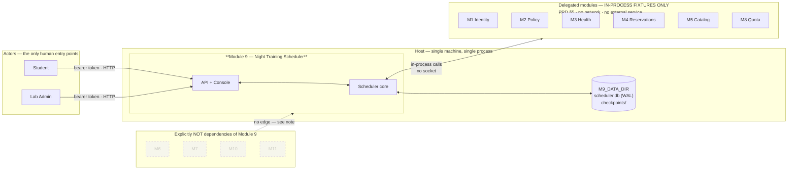
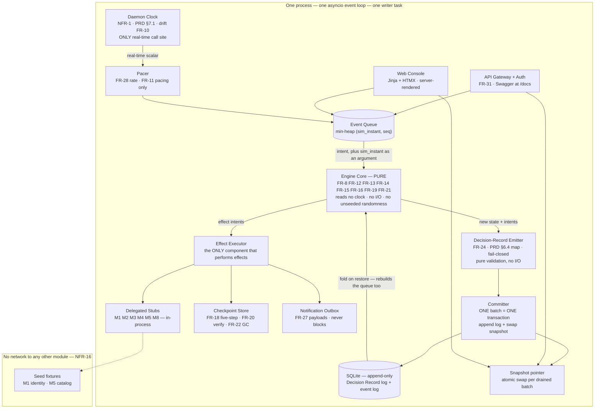

# Module 9 — Night Training Scheduler: Architecture

Binding architecture for Phase 3. Every state name, `UJ-N`, `T-N`, `FR-N`, `NFR-N`, reason code, citation authority and persona name below is taken verbatim from `planning/prd.md` and is not translated. `ux/EXPERIENCE.md` and `reviews/review-prd-adversarial.md` are inputs of equal standing. **Where this document and the PRD both speak about behaviour, the PRD wins; where both speak about structure, this document wins.** Nothing here is inferred from a document that does not exist — per PRD §0, `spec.md` and `project-brief.md` were not provided and are not inputs.

**Reference convention.** A bare `§N` in this document always means **PRD §N**, because this document has no numbered sections beyond its own six. Where this document refers to itself it says "ARCHITECTURE §N" or names the AD. `T-N` identifiers are the PRD §6.4 transition ids.

**Revision note (2026-09-28).** Two independent reviews (`reviews/review-arch-adversarial.md`, `reviews/review-arch-edge-cases.md`) returned 30 findings, all accepted by the team; their resolutions are applied here. Two are PRD amendments, referenced here rather than restated: **FR-31(e) now reads 404**, not 403, and **`self:DELEGATE-UNAVAILABLE-v1`** is now a registered citation authority in PRD §6.2. One identifier moved: the former AD-6 ("time and rate are separate") was absorbed into AD-1, and the freed slot became **AD-6 (Preemption)**, which FR-16 required and had no home for. AD-1 … AD-8 are now stable and citable for Phase 3.

**Reference convention.** A bare `§N` in this document always means **PRD §N**, because this document has no numbered sections beyond its own six. Where this document refers to itself it says "§1"–"§6" or names the AD. The previous draft used `PRD §6.4` and `§7.x` without that convention, which made them look like broken internal cross-references to a reviewer; they were always PRD sections. `T-N` identifiers are the PRD §6.4 transition ids.

**Revision note (2026-09-28).** This document previously carried `status: final` and was returned NOT SOUND by a four-lane reviewer gate. It has been revised against those findings. One identifier moved: the former AD-6 ("time and rate are separate") was absorbed into AD-1, where its rule belonged, and the freed slot became **AD-6 (Preemption)**, which FR-16 required and the previous draft had no home for. AD ids are now stable for Phase 3.

**Simulation honesty (A-3, PRD §5).** v1 models no GPU hardware, no container execution, no telemetry and no model weights. Every Training Job is a simulated process with a modelled duration and a modelled memory profile. The console states this permanently and non-dismissably.

---

## 1. Alternatives considered and the chosen design

### 1.1 The three scheduler cores

| | **A. Single process + SQLite state store** | **B. API process + engine daemon** | **C. Event-sourced reducer** ✅ |
|---|---|---|---|
| Shape | Engine + API in one process; jobs, slots, checkpoints and the log in SQL tables; API reads the tables | Engine owns its own loop in its own process; API is a thin surface; coupled by a queue (Redis/Celery) or a SQL work table | Engine core is a pure reducer `apply(state, intent) → (state', intents)`; the append-only Decision Record log is the only durable truth; state is a fold of the log; reads come from an immutable snapshot |
| NFR-7 determinism | OK — single thread, single writer | OK, but adds a serialization boundary that must never become a *time* boundary | **Strongest** — determinism is a property of the fold, not a discipline |
| NFR-10 crash recovery | OK, but 500+ transactions per activation | **Worst** — the commit point spans two stores, which is exactly where duplicate and lost transitions live | **Strongest** — restore *is* "re-fold the log", so FR-9(a)'s no-replay is the default semantic |
| NFR-14 (Invariant S-1) | in-core, free | cross-process read, and the count can lag the release | in-core, free, asserted per drained batch |
| NFR-2 (200 ms p95, 500 jobs) | **At risk** — per-job SQL round-trips inside the budget | OK | **Strongest** — the Admission Order is one fold step, zero round-trips |
| NFR-16 standalone | 1 container, 1 venv | 2 containers + readiness ordering; the venv path needs a second process | 1 container, 1 venv, no broker |

**Chosen: C.** The decisive reason is that FR-9 already *specifies* event sourcing: restore state from the durable decision log **with no replay** (FR-9(a), T-18, F-12), then run reconciliation as a **separate, recorded** step (FR-9(b)–(e)). Under C that is the natural semantics of a fold rather than a recovery feature built on top of a different storage model. FR-24(e) — the Decision Record is durable *before* the transition commits — is likewise one append rather than a transaction ordering discipline.

**A** is the fallback if the database must be the primary queryable store. Its cost is NFR-2: 500 pending jobs inside 200 ms p95 with a SQL round-trip per job is a budget spent on I/O the fold does not need.

**B** solves NFR-9 (≤ 500 ms real visibility at every rate) most cleanly, and pays for it at NFR-10 and NFR-16. Rejected.

**The trade-off accepted with C.** The log grows and state is rebuilt by folding it, so cold start is O(log prefix). Bounded by a snapshot written at each Night Window boundary, folded from the last snapshot forward. The snapshot format is a new artifact that must stay fold-compatible — a real ongoing cost, accepted because it buys the NFR-10 property outright.

### 1.2 Console delivery

**Chosen: server-rendered by FastAPI — Jinja templates plus HTMX, no Node toolchain.** `planning/prd.md` names no UI framework (EXPERIENCE.md OQ-6), and NFR-16's test is a clean local virtual environment with nothing else running. A Node build stage would make the venv path conditional on Node being installed, weakening the one requirement that carries course constraint 1. The console is served by the same process, so a state change and its Decision Record reach the page through the same snapshot swap (AD-2) with no second origin and no client-side cache to invalidate.

*This settles delivery, not the component vocabulary.* EXPERIENCE.md OQ-6 (which component library, if any) remains open; this document does not name one, and the PRD does not require one.

### 1.3 Stack

**Python 3.12+, FastAPI, SQLite, Jinja/HTMX — exact versions pinned in `requirements.txt` at implementation time.**

This section deliberately carries **no version numbers and no release dates**. An earlier draft pinned specific versions and dates; a review found the pins wrong, and that failure mode recurs on any date a document outlives. The stack is a *choice of technologies*; currency is a property of the lockfile, which is regenerated and verified at implementation time rather than asserted in an architecture document.

| Concern | Choice | Why this and not the alternative |
|---|---|---|
| Language and runtime | **Python 3.12+** | The only language the PRD permits (NFR-16, course constraint 1). A floor, not a pin. |
| API surface | **FastAPI** | Required by the PRD; supplies Swagger at `/docs` from the same Pydantic models the console renders. |
| Persistence | **SQLite** via the standard library `sqlite3`, WAL journal, `synchronous=FULL` | One process, one writer, no server, no broker — the cheapest thing that satisfies NFR-10 and NFR-16. `sqlite3` ships with Python, so it adds no dependency. |
| Console | **Jinja templates + HTMX**, server-rendered | ARCHITECTURE §1.2. No Node toolchain, no build step, no client-side state. |
| Async | the ASGI server and its async layer | One event loop (AD-1). Never more than one worker process. |

**Two floors are correctness constraints rather than pins, and are verified at startup rather than documented here.**

- **SQLite must include the WAL-reset database-corruption fix.** Module 9 uses WAL with `synchronous=FULL` and a long-lived single writer, which is the configuration that bug corrupts. Because SQLite ships with the interpreter rather than being installed separately, this is a constraint on the *Python build*; a start-up check reports it clearly rather than tolerating it, and `requirements.txt` records the resolved build.
- **Starlette, as a FastAPI dependency, is a breaking 1.x series.** The pre-1.0 `TemplateResponse(name, context)` signature is gone. Since the entire console is server-rendered Jinja, this is a build-time break, not a runtime surprise.

**Not used, and why:** no Node/npm toolchain (NFR-16, ARCHITECTURE §1.2); no message broker or second process (NFR-10, NFR-16, course constraint 1); no Kubernetes or GPU (NFR-16); no external service of any kind (NFR-16).

**Swagger** is FastAPI's auto-generated OpenAPI surface at `/docs`, generated from the same Pydantic response models the console renders (EXPERIENCE.md: it is not a degraded view).

### 1.4 Runtime, deployment and operations envelope

An architecture that cannot say how it starts, where its data lives, or how it is proven is not yet an architecture.

**Two supported run modes, one artifact.** `docker compose up` (the primary path, satisfying NFR-16's standalone test) and a local virtual environment (the development path). The same image, the same entrypoint, the same data volumes.

| Concern | Decision |
|---|---|
| Process model | One process, one Uvicorn worker, one asyncio loop. **Never `--workers > 1`** — a second worker is a second writer, which AD-1 forbids. |
| Data layout | `M9_DATA_DIR` (default `./data`) holding `scheduler.db` (SQLite, WAL) and `checkpoints/` (the AD-7 store root, a sibling of the DB, on a filesystem supporting atomic rename). Both are bind-mounted volumes. |
| Configuration | Read once at startup. Anything that changes scheduling goes through AD-1's enqueue channel, not a config reload. |
| Startup order | Verify the SQLite corruption-fix floor (ARCHITECTURE §1.3) and the PRD §6.4 map checksum (F-14) and **fail fast**; create the schema; restore by folding (AD-5); rebuild the queue; then begin draining. Serving traffic before the fold completes is a defect. |
| Authentication | `POST /auth/session` exchanges a validated Module 1 fixture bearer token for an HttpOnly, SameSite=Strict session cookie; the console reads the actor from the session and applies the same `ROLE_CAPABILITY` table as the API (AD-8). A bearer token never reaches a page. |
| Health | `GET /health` reports liveness plus pacer progress. It performs no scheduling decision and mutates nothing (AD-1). |
| Observability | Structured logs to stdout. Decision Records are the audit surface. **No token, another user's `job_id`, or credential is ever logged** (AD-8). |
| Backup and restore | The SQLite file and `checkpoints/` are backed up **together as a consistent pair** taken at a Night Window boundary; a Checkpoint without its log is unusable. Restore is the ordinary start path. |
| Data retention | The Decision Record log is append-only. Truncation is never silent: `GET /events` states the truncation point (FR-26). A run's artifacts are exported by `GET /simulations/{id}/artifacts`. |

**What is deliberately not designed.** No Kubernetes, no GPU, no broker, no external service, no second process (NFR-16, course constraint 1). No HA, no leader election, no TLS termination.

### 1.5 Verification strategy and the run gate

NFR-2, NFR-3, NFR-8 and NFR-9 are *performance* requirements and are not satisfied by a passing functional run; they are measured by a separate benchmark harness (F-36).

| Suite | Owns | Gate |
|---|---|---|
| Unit | the pure fold, the PRD §6.4 map as data, the citation grammar, the AD-8 refusal table, the AD-4 slot arithmetic and Node order | must pass before any story merges |
| Contract | the three event contracts of ARCHITECTURE §4.2, the PRD §6.1 record fields, the Swagger schema | before the console is wired |
| Integration | a full simulated night end-to-end: activation → steps → checkpoint → eviction ramp → `NIGHT_CLOSE` accounting → restore | per epic |
| Determinism | **F-26 golden fixtures** — the same `seed` and `submission_stream` must yield a byte-identical Decision Record log | per epic |
| Fault injection | NFR-10's simulated process deaths via the Fault Injector (ARCHITECTURE §2), asserting 0 duplicate and 0 lost transitions | per epic |
| Preemption | AD-6's two-part challenger gate, victim order, `PREEMPTION_REFUSED`, per-victim cap, same-night re-queue | before the Preemption story merges |
| Performance | NFR-2, NFR-3, NFR-8, NFR-9 under load, at 1x and 1440x | reported, not gated (F-36) |

**`POST /simulations` returns exactly one of `PASSED` / `FAILED`, and the run gate is PRD FR-30(d) verbatim.** The status is `FAILED` if any invariant in PRD §4 (**S-1, S-2, S-3**) or any of **NFR-4, NFR-5, NFR-6, NFR-7, NFR-10, NFR-14, NFR-16** is violated, and the response names **each** violated invariant individually (F-36). Nothing else is in the gate. Specifically:

- **NFR-1 and NFR-11 are build-time static checks, not run-gated.** They are asserted by the single-time-call-site scan (AD-1) and the fixture scan (AD-8), both of which fail the build rather than a run.
- **NFR-2, NFR-3, NFR-8 and NFR-9 are measured by a separate benchmark harness**, not by a run verdict, because a CI run without real-time discipline cannot meaningfully assert wall-clock latency (F-36).
- **F-ids are test cases, not checks.** The earlier draft listed "F-1 … F-26" and "AD rules where testable" as gate members; an F-id identifies a testable condition that a check may exercise, and an AD rule that is not a PRD invariant is not a run gate. `GET /simulations/{id}` therefore reports PRD invariants only.


## 2. Component topology

### 2.1 Context — the system box and everything outside it

The flowchart in ARCHITECTURE §2.2 is a container view. This is the level above it: what is inside Module 9, what crosses its boundary, and which of those crossings the PRD actually authorises. Every arrow here is a *dependency*, and the count is the point — NFR-16 forbids a network call to any other module, so the only outbound arrows are to the host's own storage.



**What the context view settles.**

- **Two human entry points, one HTTP surface.** Students and Lab Admins reach the same API; the difference is a role resolved by AD-8, never a second service.
- **Six delegated modules, all in-process.** `CORE` calls M1–M5 and M8 directly. There is no broker, no client library, no retry policy and no health check, because a network call to another module is forbidden by NFR-16 and by course constraint 1. A missing verdict is a blocking error, never a default ALLOW (FR-6(b)).
- **One storage dependency, inside the host.** `M9_DATA_DIR` is a directory on the same machine, not a database server. The `checkpoints/` tree sits beside the SQLite file because AD-7's five-step protocol needs an atomic rename on a real filesystem, which a SQLite blob would not give.
- **The dashed boxes have no edge, and that is the finding.** M6, M7, M10 and M11 are drawn to make the boundary explicit. M6 has **no** dependency from Module 9 in either direction: Checkpoint bytes are Module 9's own store, and nothing about M6's ownership of those bytes is designed here (PRD §5, Open Question 4). M7 is out of scope for v1 (FR-3 refuses the multi-node scope); M10 and M11 are separate modules. If a later requirement introduces a dependency on any of these, this diagram changes and so does the corresponding invariant — that is the point of drawing them.

### 2.2 Container — the process internals



**The dependency rule, which is what makes the paradigm work:** the engine core imports nothing from the API layer, the console, the stubs, the store, the queue or the clock module. It receives a state, an intent and a `sim_instant` **as arguments** and returns a new state and new intents. It has no I/O edge, and the diagram above is the enforcement surface for that claim: **every edge touching `ENG` is either inbound data or an outbound value, and every side effect in the process hangs off `COM` or `EFF`.**

**Two consequences the diagram is drawn to make visible.**

1. **Nothing that touches the filesystem or a delegate is reachable from the engine.** Checkpoint writes, stub verdicts, outbox delivery and the log append are reached only through `EFF` and `COM`. If a future change needs the engine to read a file, the design is wrong, not the diagram.
2. **The clock is a value source, not a service the engine calls.** `CLK` is the single real-time call site in the whole module and it feeds both the engine's `sim_instant` argument and the Pacer's rate scalar. The Pacer therefore does **not** read real time itself — a second real-time call site anywhere in the module is a build failure under NFR-1, and the Pacer was the one violation in the previous draft of this diagram.

| Component | Owns | May read | The one rule it must not break |
|---|---|---|---|
| **API gateway / auth** (FR-31) | nothing; validates the bearer token against the M1 identity fixture, resolves the role from one `ROLE_CAPABILITY` table | snapshot | No anonymous request reaches a scheduling decision (F-40). Deny by default: an unknown route, an unknown role or a missing capability row is a refusal, never an allow. See AD-8. |
| **Scheduler engine core** | the pure fold: `apply(state, intent, sim_instant) → (state', intents)` | its own `state` argument, the `sim_instant` argument, the clock scalar passed in, the seeded RNG | Performs no I/O, reads no clock, uses no unseeded randomness. See AD-1, AD-2. |
| **Clock** (NFR-1, FR-10) | `sim_instant`; the single real-time call site; the drift latch; the Pacer's rate scalar | the Simulated Clock in simulation mode, the host monotonic clock in native mode | No component outside this module reads wall-clock or process time, **and no second real-time call site exists inside it.** A second one is a build failure. |
| **Committer** (FR-24) | the transaction boundary: the log append and the snapshot swap, together | the validated records from the emitter | **One drained batch is one transaction.** State and its Decision Records become durable together or not at all. See AD-2. |
| **Effect Executor** | performing the effects the engine requests; marshalling their results back as intents | the engine's effect intents | Performs no scheduling decision. Its result returns to the engine as an input, never as a side effect on state. |
| **Decision-Record emitter** (FR-24, PRD §6.4) | validating a transition against the PRD §6.4 map, which is **data**, not branching | the transition, the PRD §6.4 transition → (decision, reason, citations) map | Pure. A record that fails validation is refused and the transition is not applied. See AD-3. |
| **Checkpoint store** (FR-18, FR-20, FR-22) | Checkpoint bytes and their metadata; Quarantine; the 03:00 collection; the store-local quarantine of a Checkpoint whose verification is in doubt | the store budget | The 2 most recent verified Checkpoints of a non-terminal job and every Quarantined Checkpoint are never removed automatically. |
| **Stubs M1–M5 / M8** (PRD §5) | fixture-driven verdicts: entitlement, policy + freeze, health + cordon authority, reservations, catalog, quota | seed fixtures, plus the in-process fault schedule | This module never computes an entitlement, a quota or a policy verdict. A missing verdict is a blocking error, never a default ALLOW (FR-6(b)). |
| **Notification outbox** (FR-27, F-43) | the payloads | the committed Decision Record | Delivery never blocks the transition that triggered it. A failed delivery is recorded as `DELIVERY_FAILED` and retried. |
| **Web console** (EXPERIENCE.md) | nothing; renders | the snapshot and the same payloads Swagger serves | Never renders a new slot state without its Decision Record — state and record arrive in one batch (AD-2). |
| **Pacer** (FR-28) | the rate scalar `1× / 60× / 360× / 1440× / pause` it was handed | the scalar from the Clock module — **not** a clock of its own | Pacing only. It may not reorder, add or remove a queued transition (FR-11(b)). See AD-1. |
| **Event queue** | the min-heap keyed `(sim_instant, seq)`; the derived queue rebuilt from the log on restore | — | Ties at an identical instant resolve by the stable `seq`. `seq` is derived from the Admission Order rank for admission events and from a per-batch monotonic counter for every other event class; it is never left undefined. |
| **SQLite log** | the durable, append-only Decision Record log and lifecycle event log | — | Records are immutable and append-only (FR-24(d)). |
| **Snapshot pointer** | the current immutable read view | — | Swapped atomically, once per drained batch, carrying the folded state *and* the records committed in that batch. |
| **Fault injector** (NFR-10, FR-29) | the in-process fault schedule: process death, disk-full, latency, and a delegate's missing or misbehaving verdict | the fault schedule, in simulation mode | The only component permitted to break invariants. `daemon crash` is realised as **in-process simulated process death**: the writer task is torn down, in-memory state is discarded, and the process is left alive so the restore path re-folds from the log. That is what makes NFR-10's 1000-kill test runnable inside a single process. |

**Reads never touch the log.** Every API handler and console route reads the snapshot. This is what keeps NFR-2 (200 ms p95 over 500 jobs) and NFR-3 (50 ms p95 per-job) free of I/O, and it is the mechanism behind NFR-9's 500 ms real-time visibility at every rate.

---

## 3. Data model

### 3.1 Entities

Field names are the internal model. `sim_instant` is always a Daemon Timestamp with an explicit `America/Bogota` (UTC−05:00) offset (D-1, PRD §7.1) — a persisted timestamp without the offset is not a Daemon Timestamp.

**The nine states, verbatim from PRD §4, and the transitions that move between them.** The previous draft of this document never wrote the enum out, so three states and four transitions had no architectural home at all. The names below are PRD Glossary terms and are not renamed here. The transition ids, decisions, reasons and citations for every row are defined in **PRD §6.4** and are deliberately not copied into this document — this table fixes *ownership* and *ordering*, PRD §6.4 fixes *content*.

| State | Owning transition out | Which rule owns it |
|---|---|---|
| `REJECTED` | — terminal | Emitted at submission when FR-2 validation fails. Never entered the Pending Set. |
| `QUEUED_PENDING_WINDOW` | `T-1` admit, `T-2` re-admit, `T-20` re-admit after `EVICTION_FAILED`, `T-4a` / `T-4b` / `T-18` defer, `T-15` expire | AD-1 (queue), AD-2 (commit) |
| `RUNNING` | `T-6` evict, `T-7` preempt, `T-10` fail, `T-22` (one automatic retry) / `T-23` process exit, `T-12` / `T-13` checkpoint-path failure, `T-5` complete | AD-4 (slots), AD-6 (preempt), AD-7 (checkpoint). **There is no `T-11`** — deleted in the PRD's own adversarial review; the earlier draft of this row still routed through it. |
| `CHECKPOINTING` | `T-8` evict complete, `T-9` deadline missed | AD-7; a substate of the Eviction Ramp or of a Preemption |
| `EVICTED_RESUMABLE` | `T-2` re-admit next window; `T-14` re-place **the same night** when the job was preempted | AD-7 — resumable only from a `VERIFIED` Checkpoint (Invariant S-2) |
| `COMPLETED` | — terminal | **`T-5`**: all steps finished before the deadline. Reached from `RUNNING`; slots released atomically per AD-4 and `NIGHT_CLOSE` still applies. |
| `FAILED` | — terminal | `T-10`, `T-13`, `T-21`, `T-23`, a Max Night Span refusal (Invariant S-3), and a `CHECKPOINT_CORRUPT` digest mismatch. `T-22` is the retry and is **not** terminal. Last verified Checkpoint, if any, is retained per FR-22. |
| `EVICTION_FAILED` | `T-20` re-admit next window | **Non-terminal and recoverable**, which is why it is its own state and not `FAILED`. The Eviction Ramp could not produce a verified Checkpoint; a Cordon Request is issued against the Node and the job is re-admitted to the next Night Window. Checkpoint corruption is **not** a sub-reason here — it is detected only at resume time and routes to `FAILED` (AD-7). |
| `EXPIRED` | — terminal | **`T-15`**: the Retention Deadline passed without admission. Its Checkpoints become eligible for garbage collection at the 03:00 reaper, and the PRD §6.2 `self:`-alone citation allowance applies to it (F-1, NFR-4). |

**Three ordering rules that the state machine does not imply on its own.**

1. **`T-4a` is decided before `T-4b`.** Within one `WINDOW_ACTIVATION`, the engine first tests whether the Eligible Node set is *statically empty* — every Node excluded for a reason that a later job could not fix (cordon, health, reservation, VRAM class). Static emptiness produces `T-4a NO_ELIGIBLE_NODE` for every eligible job, and no ranking is computed. Only when the set is not statically empty does the engine compare the ranked demand against free slots, producing `T-4b CAPACITY_EXHAUSTED`. A single `T-4b` in a night with zero eligible Nodes would be a misclassification, so the static test is not an optimisation but the first branch.
2. **A transition's slots are released before its record is emitted, never after.** This is true of `T-5`, `T-6`/`T-8`, `T-9` and `T-10` alike, and is what makes Invariant S-1 hold even if the process dies between the two. A crash after release and before commit is resolved by AD-5's fold, which finds the slots already free.
3. **`T-22` and `T-23` are not special cases.** A process exit (`T-22`) and an OOM kill (`T-23`) that occur during a `WINDOW_ACTIVATION` or an eviction ramp are ordinary transitions with an ordinary `T-` row in PRD §6.4; they consume the AD-1 retry budget and resolve on restore through AD-5. Neither is implemented as a special case in the restore path, because a restore that special-cases them is a restore that can disagree with the log.

**`Job`** — one Training Job. One Job occupies exactly one Node for the duration of one contiguous `RUNNING` interval.

| Field | Type | Notes |
|---|---|---|
| `job_id` | str | `JOB-NNNN` |
| `state` | enum | exactly the nine states of PRD §4.1, and no others (FR-25(a)) |
| `state_reason` | str \| null | the PRD §6.4 reason code; mandatory on `FAILED`, `EVICTED_RESUMABLE`-adjacent exits and every `REJECTED` |
| `spec` | `JobSpec` | see ARCHITECTURE §3.2 |
| `idempotency_key` | str | unique; FR-1(a), FR-5 |
| `payload_digest` | hex | same key + same digest → 200 with the original `job_id`; same key + different digest → 409 (F-29) |
| `submitter_actor_id` | str | opaque, from the M1 fixture. A display name is never stored (NFR-11, F-32) |
| `submitted_at` | Daemon Timestamp | the client's wall-clock reading is advisory only (FR-1) |
| `granted_priority` | enum | `EXPLORATION`=10, `THESIS`=50, `URGENT`=90. Read-only to this module (FR-14(b)); never the student's declaration |
| `declared_intent_request` | enum \| null | stored as a request visible to the administrator, status `PENDING_REVIEW`, never applied (FR-17(c)) |
| `consecutive_nights_missed` | int | +1 on a night with zero admitted minutes; reset to 0 on any admitted minute (FR-14(d)) |
| `effective_priority` | int | `granted_priority + min(consecutive_nights_missed × AGING_RATE, AGING_CAP)`, `AGING_RATE=6`, `AGING_CAP=30` (FR-14(a)) |
| `admitted_nights` | int | ≤ `max_night_span`; S-3 |
| `estimated_duration_s` | int | seconds, with a stated confidence; trusted as declared when declared (FR-4(a), A-11) |
| `estimated_completion_nights` | int | FR-4 output |
| `admitted_duration_s` | int | the sum of admitted intervals, excluding Ramp and downtime (FR-21(d)) |
| `retention_deadline` | Daemon Timestamp | `JOB_TTL = 14 days` from submission, extended by 14 days from each admitted night (FR-7(b), A-22) |
| `last_node_id` | str \| null | FR-13(a) prior-Node preference |
| `last_verified_checkpoint_id` | str \| null | the only resume source (FR-21(a)) |
| `allocation_id` | str \| null | the slot set held, null unless `RUNNING` or `CHECKPOINTING` — S-1 |

**`JobSpec`** — the validated, normalised form. **The engine never reads a Job Spec field name**; it reads this record. See ARCHITECTURE §3.2.

**`GpuSlot`** and **`Node`** — 32 Nodes, **33 `GpuSlot` rows**: `ws-gpu-01`…`ws-gpu-31` at 24 GB each, `server-gpu-01` at two 48 GB slots (F-42, A-4). A slot carries `node_id`, `slot_index`, `vram_class`, `occupied_by_allocation_id`, and an eligibility mark: `M3_CORDONED` · `M4_RESERVED` · `VRAM_CLASS_INSUFFICIENT` (FR-12, FR-25(d)). `FREE` is the eligible-unheld case, not an exclusion.

**`Allocation`** — the unit of holding a Node. A non-empty subset of the slots of **one** Node: size 1, or size 2 which must be exactly both slots of `server-gpu-01` (AD-4, F-42, FR-2(k)). Released all-or-nothing. `allocations_held` is the count of `GpuSlot` rows in an active allocation — the number NFR-14 asserts is 0 at every simulated minute in 06:00:00–22:00:00.

**`CordonRequest`** — this module's request to M3; it never cordons a Node itself (PRD §5). Carries `node_id`, `cause` (e.g. `EVICTION_CHECKPOINT_WRITE_FAILED`), `state` (`REQUESTED` / `ACKNOWLEDGED` / `REJECTED` / `CLEARED`), and the clearing actor. The Node is treated as not-Eligible **optimistically, immediately, and locally**, without waiting for M3's acknowledgement (A-15, FR-23(c), FR-23(h)).

**`Checkpoint`** — `checkpoint_id`, `job_id`, `path`, `bytes`, `step`, `digest` (SHA-256), `sim_timestamp`, `state` (`WRITING` / `VERIFIED` / `QUARANTINED` / `DELETED`), `written_by` (`periodic` \| `ramp` \| `preemption`). `VERIFIED` is set only when digest, byte count, step number and Simulated Timestamp are committed together (FR-18(c)).

**`DecisionRecord`** — exactly the eleven fields of PRD §6.1, verbatim: `decision_id`, `job_id`, `node_id`, `sim_timestamp`, `decision`, `transition`, `actor_id`, `summary`, `citations`, `inputs`, `supersedes`. Immutable and append-only. `transition` is `null` on every non-transition record (FR-24(f), F-23).

**`LifecycleEvent`** — the FR-26 log. Append-only, survives restart, records cordons and clearances with the same rigour as successes, and carries a distinct `CORDON_CLEARED` event type with an actor (FR-26(c)).

**`Notification`** — the FR-27 payload in the local outbox: job, outcome, last verified Checkpoint step, next eligible action, delivery status.

**`RunManifest`** — `(seed, submission_stream, fault_schedule, simulated duration, operator_action_schedule)`. A run's identity is that triple (FR-30, NFR-7, PRD §7.4).

**`PriorityGrant`** — `job_id`, `granted_priority`, `actor_id`, `reason_code` (mandatory and non-empty for `URGENT`, FR-17(b)), `scope` = per job (A-13), and `revoked_at`. Revocation takes effect at the next Admission Order computation and never aborts a `RUNNING` job (FR-17(d)).

### 3.2 Job Spec → internal model mapping (F-39, deferred to Phase 3)

F-39 was accepted with the resolution that the Job Spec **deliberately keeps the Kubeflow/Kubernetes vocabulary** of the course's technology baseline, so a V2 Kueue/Slurm integration needs no new contract — and that the field → internal-model mapping is this phase's deliverable. That makes the mapping **inbound, total, and one-way**: the wire contract speaks K8s; the internal model is the only thing the engine reads; a V2 integration produces the same internal records from a different inbound contract without touching a single line of scheduling logic.

| # | Job Spec field as submitted | Internal field | Type / unit | Rule | On violation |
|---|---|---|---|---|---|
| 1 | `spec.worker_count` | `JobSpec.worker_count` | int | FR-3(a) | `REJECTED`, `OUT_OF_SCOPE_DISTRIBUTED`, `self:SCOPE-BOUNDARY-v1`, names Module 10 |
| 2 | `spec.replicas` | `JobSpec.replicas` | int | FR-3(a) | as row 1 |
| 3 | `spec.elastic_policy`, `nprocPerNode: auto`, any rendezvous key | `JobSpec.distributed_artifact_present` | bool | FR-3(b) | as row 1 |
| — | — | — | — | **rows 1–3 short-circuit before FR-2 runs** (F-28), so a multi-worker spec is never field-validated | — |
| 4 | `…containers[0].image` | `JobSpec.image_digest` | `str`, must contain `@sha256:<64 hex>` | FR-2(a) — pinned by digest, not tag | `VALIDATION_FAILED` rule `image-digest`, `self:JOBSPEC-VALIDATION-v1` |
| 5 | `…resources.requests["nvidia.com/gpu"]` | `JobSpec.gpu_slots_requested` | int ∈ {1, 2} | FR-2(b) | rule `gpu-count` |
| 6 | `…resources.limits["nvidia.com/gpu"]` | — | int | FR-2(d): limits must equal requests, because quota accounting reads `requests` | rule `requests-eq-limits` |
| 7 | `…resources.requests["memory"]` | `JobSpec.memory_request_bytes` | int bytes | FR-2(d) | rule `requests-eq-limits` |
| 8 | `…resources.limits["memory"]` | — | int bytes | FR-2(d) | rule `requests-eq-limits` |
| 9 | `spec.required_vram_gb` (absent ⇒ derived from the M5 model record) | `JobSpec.required_vram_gb` | enum {24, 48} | FR-2(c): must not exceed the largest single-Node VRAM class, 48 GB | rule `vram-class`; the message names the requested and available classes |
| 10 | — (implied by row 5 + row 9) | `JobSpec.requires_spanning_slots` | bool | FR-2(k): `gpu_slots_requested = 2` is valid **only** at 48 GB, i.e. only `server-gpu-01` and only both of its slots | rule `two-gpu-requires-48gb`, `self:JOBSPEC-VALIDATION-v1` — so no admitted job is ever unplaceable (E-3) |
| 11 | `spec.nodeSelector` | `JobSpec.pinned_node_id` | str \| null | FR-2(e): must name a Node matching a declared VRAM class | rule `node-selector` |
| 12 | `spec.checkpoint_interval_minutes` | `Job.checkpoint_interval_minutes` | int ∈ [1, 30] | FR-2(g), F-17 — a longer interval would let progress since the last Checkpoint exceed what the 300 s Checkpoint Budget can flush | rule `checkpoint-interval` |
| 13 | `spec.restart_policy` | `JobSpec.restart_policy` | enum | FR-2(f): must not request a restart that would silently re-enter a Night Window without re-admission. The only automatic retry is **max 1** `PROCESS_EXIT` retry per night (T-22, F-10) | rule `restart-policy` |
| 14 | `spec.storage.request_bytes` | `JobSpec.storage_request_bytes` | int bytes | ARCHITECTURE §3 Checkpoint store; contributes to the NFR-13 budget formula | `DENY STORE_FULL`, `self:CHECKPOINT-STORE-BUDGET-v1` |
| 15 | `spec.model.id` | `JobSpec.model_id` | str | FR-2(h): the M5 record must exist and not be deprecated; **re-checked at every Window Activation** | `VALIDATION_FAILED` rule `model-record` → `catalog:M5/…`; at activation → T-21 `FAILED MODEL_DEPRECATED` |
| 16 | `spec.estimated_duration_s` (absent ⇒ derived from the M5 model record) | `Job.estimated_duration_s` + `Job.estimate_confidence` + `Job.estimate_source` | int seconds + enum | FR-2(i), FR-4(a) | rule `estimate-missing` |
| 17 | — (derived, never submitted) | `Job.requires_multiple_nights` | bool | FR-4(b): set **unconditionally** when the estimate exceeds the 7 h 45 min Usable Night Duration. Never a rejection on its own | — |
| 18 | — (derived) | `Job.max_night_span` | int = 5 | FR-2(j), FR-4(c): an estimate above **38.75 h** (5 × 7 h 45 min, F-14) is refused at submission with at least one concrete scope reduction | `DENY`, `self:MAX-NIGHT-SPAN-v1` |
| 19 | `spec.declared_intent` | `Job.declared_intent_request` (`PENDING_REVIEW`) | enum \| null | FR-17(c). A self-declared intent is a recorded *request* and never a Granted Priority; it contributes nothing to `effective_priority` (FR-14(c)) | — |
| 20 | `metadata.idempotencyKey` / `X-Idempotency-Key` | `Job.idempotency_key` + `Job.payload_digest` | str + hex | FR-1(a), FR-5 | 409 on digest mismatch, no job created (F-29) |
| 21 | `apiVersion`, `kind` (`TrainingJob` / `PyTorchJob`) | `JobSpec.k8s_api_version`, `JobSpec.k8s_kind` | str | **Retained verbatim, never interpreted.** This is the whole point of F-39: the envelope survives so a V2 Kueue contract is additive | — |
| 22 | — (from M2 or an administrator grant) | `Job.granted_priority` | enum | FR-14(b), FR-17. Read-only to this module | — |
| 23 | — (placement result, FR-13) | `Allocation.slot_set` + `Job.last_node_id` + `JobSpec.pinned_node_id` | slot refs | FR-13(a) prior-Node preference, with `PRIOR_NODE_INELIGIBLE` recorded when it is not Eligible | — |

**FR-2 reports every failing field individually**, never one generic refusal: the validation result is a per-field `pass` or `rule_id` plus a human-readable message, and each `rule_id` above is the value that appears. The three-rejection testable condition — digest (a), VRAM class (c), Checkpoint interval (g) — resolves to rows 4, 9 and 12 and must produce exactly three.

**Not decided here:** what happens to an unrecognised Job Spec field. The PRD does not say, and the F-39 rationale pulls both ways — strict rejection protects the internal model, preservation serves the V2 contract. See ARCHITECTURE §6.3, OQ-1.

---

## 4. API routes and event contracts

### 4.1 Routes (high level)

Every route below requires a bearer token validated against the M1 identity fixture (FR-31(a)). `STUDENT` may submit and read its own jobs; `LAB_ADMIN` may additionally grant priority, clear cordons and control the simulation (FR-31(b)–(c)).

| Method | Route | FR | Role | Notes |
|---|---|---|---|---|
| `POST` | `/jobs` | FR-1, FR-2, FR-3, FR-4, FR-5, FR-6, FR-7 | `STUDENT`, `LAB_ADMIN` | 201 on admission, 200 on an idempotent repeat, 409 on a reused key with a different digest, 400 on a missing delegated verdict |
| `GET` | `/jobs/{job_id}` | FR-25 | `STUDENT` (own), `LAB_ADMIN` | state, position-or-placement, the last 10 Decision Records with citations, `next_decision_at`. The 10 is an upper bound and the response is never padded (EXPERIENCE.md) |
| `GET` | `/jobs?query=` | FR-25, FR-31(b) | viewer-scoped | `STUDENT` search is scoped to its own jobs; `LAB_ADMIN` is fleet-wide |
| `GET` | `/board` | FR-25 | both | 33 slot rows; every idle slot carries a reason code, never blank |
| `GET` | `/admission-order` | FR-8, FR-15, FR-25 | `LAB_ADMIN` | every ranked row of the **queued subset**, each carrying its decision and citation. The response length is the **true length** and is never padded to 500: `QUEUE_DEPTH_CAP` = 500 bounds *admission* and is checked against **all** non-terminal jobs at `T-1` (AD-1), which is a different set from this list |
| `GET` | `/nodes/{node_id}` | FR-12, FR-13 | `LAB_ADMIN` | slot occupancy, exclusion reasons, the FR-13 placement candidates |
| `POST` | `/nodes/{node_id}/cordon/clear` | FR-23, FR-26(c), FR-31 | `LAB_ADMIN` | records `CORDON_CLEARED` with the actor. States explicitly that clearing the node does not gate the job (T-20) |
| `POST` | `/checkpoints/{id}/quarantine/release` | FR-20(c)(d) | `LAB_ADMIN` | requires a reason code. Issues **no** Cordon Request (FR-20(e)) |
| `POST` / `DELETE` | `/jobs/{job_id}/grant` | FR-17 | `LAB_ADMIN` | `URGENT` refused without a reason code |
| `GET` | `/decisions` | FR-24 | both (scoped) | the citation list is the payload |
| `GET` | `/events` | FR-26 | `LAB_ADMIN` | append-only; truncation is stated, never silent |
| `GET` | `/notifications` | FR-27, F-43 | viewer-scoped | the local outbox; `DELIVERY_FAILED` is a status here |
| `GET` / `PATCH` | `/clock` | FR-28, NFR-1 | `LAB_ADMIN` (PATCH) | `1× 60× 360× 1440× ⏸`; the rate is a pacing scalar only |
| `POST` | `/simulations` | FR-30 | `LAB_ADMIN` | 202 with a run id; 400 when `seed`, `submission_stream`, `fault_schedule` or `duration` is missing, and no run is created |
| `GET` | `/simulations/{id}` | FR-30(c)(d) | `LAB_ADMIN` | `RUNNING` then exactly one of `PASSED` / `FAILED`; `FAILED` names each violated invariant individually (F-36) |
| `GET` | `/simulations/{id}/artifacts` | FR-30(b) | `LAB_ADMIN` | manifest, Decision Record log, event log |
| `GET` | `/openapi.json`, `/docs` | — | — | Swagger; the same payload schemas the console renders |
| `POST` | `/auth/session` | FR-31 | authenticated | a validated Module 1 fixture bearer token in, an **HttpOnly, SameSite=Strict** session cookie out. The console reads the actor from the session and applies the same single `ROLE_CAPABILITY` table as the API (AD-8), so a bearer token never reaches a page |
| `GET` | `/health` | NFR-16 | — | process liveness and pacer progress, deliberately not a scheduling decision. **The previous draft cited FR-16 here, which was a fabricated reference: FR-16 is Preemption.** |

### 4.2 Event contracts

**Three distinct messages, and conflating them is the defect this section prevents.**

**(a) `TransitionIntent` — engine → emitter.** Produced by the pure core. Carries `transition` (the ARCHITECTURE §4.2 id), `job_id`, `node_id`, `from_state`, `to_state`, `state_reason`, `inputs` (the PRD §6.1 `inputs` object: effective priority, consecutive nights missed, granted priority, VRAM class, elapsed runtime, remaining budget), the delegated verdicts consulted, and `actor_id`. It carries **no** `decision`, **no** `summary` and **no** `citations`: those are the emitter's job, and the PRD §6.4 map is the only place they come from.

**(b) `DecisionRecord` — emitter → log, console, API.** The eleven PRD §6.1 fields, verbatim. The emitter resolves `(transition → decision, reason, required citations)` from the PRD §6.4 map as **data**, not as per-transition branching, and then validates: ≥ 1 citation always; a non-`self:` citation unconditionally on every `PREEMPT` and `EVICT` and on a `DENY` based on a delegated verdict; `self:` alone permitted only for a `DENY` on a module-owned rule (scope boundary, Max Night Span, queue cap, Job Spec validation) and an `EXPIRE` on a Retention Deadline (F-1, NFR-4). T-8's completion record carries the initiating T-6/T-7 record's `decision` and sets `supersedes` to it. A record that fails validation is refused, the intent is discarded, and an `EMITTER_REJECTED` integrity event is written (AD-3).

**(c) `StateChange` — snapshot → console / API.** The folded state delta for one batch plus the records committed in that batch, delivered atomically. A surface never renders a new slot state without its record (AD-2, FR-25(b)).

**Commit ordering, which is FR-24(e) made structural:** open one SQLite transaction → insert the Decision Record row(s) and the LifecycleEvent row(s) → `COMMIT` → swap the snapshot pointer → deliver the batch. Nothing is visible before it is durable, and nothing is durable without a record.

---

## 5. Mermaid diagrams — the core algorithm

### 5.1 Window Activation at 22:00:00 (FR-8)

```mermaid
sequenceDiagram
    autonumber
    participant P as Pacer
    participant Q as Event Queue<br/>(sim_instant, seq intra-batch tiebreak)<br/>durable key is decision_id (AD-1)
    participant E as Engine Core (pure)
    participant X as Effect Executor<br/>the only component that performs effects (AD-1)
    participant M as Stubs M1 M2 M3 M4 M5 M8
    participant D as Emitter + Committer<br/>the only writer (AD-2)
    participant L as SQLite Log
    participant S as Snapshot
    participant U as Console / Swagger

    P->>Q: advance sim_instant to 22:00:00 exactly (AD-1)
    Q->>E: dequeue WINDOW_ACTIVATION
    E->>E: drift latch clear? (FR-10b)
    E->>X: effect intent — entitlement M1 · policy + freeze M2 · quota M8
    X->>M: entitlement M1 · policy + freeze M2 · quota M8
    alt any verdict missing, or a freeze is latched
        E->>D: FR-8(e) blocked-activation record, transition: null, block reason<br/>+ T-18 DEFER citing the missing authority;<br/>a missing verdict cites self:DELEGATE-UNAVAILABLE-v1 (E-5)
        D->>L: commit record + lifecycle event
        D->>S: swap snapshot (state + record in one batch, AD-2)
        E->>Q: re-enqueue WINDOW_ACTIVATION at +5 simulated min, until 04:00:00
    else all four verdicts present and ALLOW
        E->>X: effect intent — health + SchedulingDisabled M3 · reservations M4
        X->>M: health + SchedulingDisabled M3 · reservations M4
        E->>E: Eligible Node set with per-Node exclusion reason (FR-12)
        E->>E: Admission Order = Starvation Promotion, then Effective Priority, then submitted_at (FR-8a, FR-14, FR-15)
        loop for each job in Admission Order rank
            E->>X: effect intent — catalog M5 deprecation re-check
            X->>M: catalog M5 deprecation re-check (FR-6d)
            alt model deprecated
                E->>D: T-21 FAIL MODEL_DEPRECATED · catalog:M5/...
            else Eligible slot set is empty
                E->>D: T-4a DEFER NO_ELIGIBLE_NODE · node-state:M3/..., reservation:M4/...
            else rank exceeds free Eligible slots
                E->>D: T-4b DEFER CAPACITY_EXHAUSTED · node-state:M3/... + policy:M2/...
            else
                E->>X: effect intent — re-consume policy + freeze M2 and re-evaluate<br/>health M3 + reservations M4 from the current batch snapshot (E-11)
                X->>M: re-consume M2 policy and freeze, then M3/M4 eligibility (FR-12d)
                Note over E: stop at the first latched freeze; every remaining rank takes<br/>T-18 DEFER citing policy:M2 -- never a stale verdict (E-11)
                E->>E: T-3 select Node (FR-13) + atomic slot set (AD-4)
                E->>D: T-3 ADMIT · granted-priority source + node-state:M3/... (+ reservation:M4/... when consulted)
                D->>L: commit record + lifecycle event
                D->>S: swap snapshot
                D-->>U: deliver state change + its record, one batch
            end
        end
    end
    E->>E: activation is idempotent — a second activation in this window places nothing (FR-8d)
```

### 5.2 The Eviction Ramp, 05:45:00 → 05:53:00, and the mandatory edge case (FR-19, FR-23)

```mermaid
sequenceDiagram
    autonumber
    participant P as Pacer
    participant Q as Event Queue
    participant E as Engine Core (pure)
    participant X as Effect Executor<br/>the only component that performs effects (AD-1)
    participant K as Checkpoint Store
    participant M as Stub M3
    participant D as Emitter + Committer<br/>the only writer (AD-2)
    participant L as SQLite Log
    participant S as Snapshot
    participant O as Notification Outbox

    P->>Q: advance sim_instant to 05:45:00
    Q->>E: dequeue EVICTION_RAMP_START
    loop every RUNNING job, in ONE transaction, never split (FR-19a, AD-2)
    Note over E,D: every T-6 carries sim_instant = 05:45:00 -- SIGTERM is the<br/>ramp's instant, not the instant the job was reached (E-3)
        E->>D: T-6 EVICT · self:EVICTION-RAMP-v1 + node-state:M3/... (>=1 non-self:, NFR-4)
        D->>L: commit record
        E->>Q: enqueue CHECKPOINTING
    end
    Note over E,K: per job, independently — release on this job's exit, not at 05:53:00 (FR-19d)
    Q->>E: dequeue CHECKPOINTING
    E->>X: effect intent — write temp, fdatasync
    X->>K: write temp, fdatasync(file), atomic rename, fsync(parent dir), sha256 (FR-18a, AD-7)
    alt all five steps complete by the sim_instant of the fifth step, and that<br/>instant is at or before 05:53:00 -- the commit may follow the deadline (E-2)
        K-->>E: digest + bytes + step + sim_instant of the fifth step
        E->>E: release the job's slot set FIRST, immediately (FR-19d)
        E->>D: T-8 EVICT, supersedes the T-6 record
        D->>L: commit record
        D->>S: swap snapshot
        E->>X: effect intent — notify submitter — last verified step, next eligible resume
        X->>O: notify submitter — last verified step, next eligible resume (FR-27)
    else the write errors (T-10, the mandatory edge case)
        K-->>E: typed write failure
        E->>E: release the slot set FIRST, unconditionally, before any retry or diagnosis (FR-23a)
        E->>X: effect intent — Cordon Request naming ws-gpu-19 + EVICTION_CHECKPOINT_WRITE_
        X->>M: Cordon Request naming ws-gpu-19 + EVICTION_CHECKPOINT_WRITE_FAILED (FR-23c)
        E->>D: T-10 FAIL CHECKPOINT_WRITE_FAILED · node-state:M3/... + self:EVICTION-RAMP-v1
        D->>L: commit record
        E->>D: FR-23(c) CORDON record, transition: null
        D->>L: commit record
        Note over E: a write failure with cause STORE_FULL applies T-10 WITHOUT<br/>a Cordon Request -- a full store is not a faulty Node (FR-23i, AD-7)
        E->>X: effect intent — exactly two notifications — submitter and lab admin
        X->>O: exactly two notifications — submitter and lab admin (FR-23f)
        Note over E: last verified Checkpoint retained, never deleted (FR-23e, S-2);<br/>no retry on the same Node (FR-23b); the Node stays not-Eligible<br/>even if M3 rejects the request (FR-23h, A-15); if this Checkpoint was<br/>written for a PREEMPTION, the challenger's placement is CANCELLED and the<br/>challenger returns to the Admission Order (E-13)
    end
    P->>Q: advance sim_instant to 05:53:00
    Q->>E: dequeue SIGKILL
    Note over E,Q: at an identical instant T-8 ranks AHEAD of SIGKILL, so a<br/>Checkpoint durable at 05:53:00.000 is committed, not destroyed (E-2)
    E->>E: kill every job still in CHECKPOINTING, regardless of state (FR-19c)
    alt no verified Checkpoint by 05:53:00
        E->>E: release the job's slot set FIRST, before the failure record (FR-19d)
        E->>D: T-9 FAIL CHECKPOINT_DEADLINE_MISSED · self:EVICTION-RAMP-v1
        D->>L: commit record
        D->>S: swap snapshot
        Note over E: last verified Checkpoint retained per S-2
    end
    E->>X: effect intent — assert allocations_held == 0 at 06:00:00
    X->>S: assert allocations_held == 0 at 06:00:00 (Invariant S-1, NFR-14)
```

### 5.3 Crash, restore, and reconciliation (FR-9, NFR-10)

```mermaid
sequenceDiagram
    autonumber
    participant OS as Host
    participant L as SQLite Log
    participant E as Engine Core
    participant X as Effect Executor<br/>the only component that performs effects (AD-1)
    participant M as Stubs M1-M5 M8
    participant D as Emitter + Committer<br/>the only writer (AD-2)

    OS--xE: abrupt kill at an arbitrary instant
    Note over L: last committed decision_id is durable — one transaction<br/>per commit (AD-2), so 0 committed transitions are lost.
    seq is an intra-batch tiebreak that resets each batch and is never<br/>persisted globally, so it cannot be a restore watermark (F-2)
    OS->>E: restart
    E->>X: effect intent — read last_committed_decision_id, then every log row<br/>with decision_id <= it
    X->>L: read last_committed_decision_id, then every log row with decision_id <= it
    E->>E: fold the log prefix into state — apply NO transition (FR-9a, T-18, F-12)
    E->>E: rebuild the queue from the AD-1 inventory (AD-5)
    E->>D: T-18 DEFER DAEMON_RESTORE · self:RECONCILIATION-v1
    D->>L: commit record
    Note over E: reconciliation is a SEPARATE, recorded step (FR-9b, F-12)
    E->>E: enumerate EVERY scheduled event whose sim_instant elapsed while the<br/>daemon was down -- not only the 22:00:00 window (E-6)
    E->>E: an elapsed CHECKPOINT_DEADLINE (05:53:00) releases its slot and<br/>records that release BEFORE the reconciliation record; an elapsed<br/>NIGHT_CLOSE (06:00:00) has its T-19 accounting recorded first (E-6)
    alt an elapsed 22:00:00 and the Night Window is still open
        E->>X: effect intent — re-consume every delegated verdict
        X->>M: re-consume every delegated verdict (FR-6a)
        E->>D: FR-9(c) ADMIT RECONCILIATION_ACTIVATION · self:RECONCILIATION-v1
        D->>L: commit record
    else the window has also closed
        E->>D: FR-9(d) DEFER MISSED_WINDOW · self:RECONCILIATION-v1
        D->>L: commit record
    end
```

---

## 6. Architectural Invariants

### 6.1 AD-1 … AD-8

---

#### AD-1 — One writer, one clock, one queue: everything enters as a scheduled event with a deterministic key

- **Status:** `[ADOPTED]`
- **Binds:** FR-10(a), FR-11(a)–(c), FR-19(a), FR-19(c), FR-20(d), FR-28(a)–(c), NFR-1, NFR-5, NFR-6, NFR-7, NFR-14, PRD §4.1, PRD §7.1, PRD §7.2, PRD §6.4 `T-19`
- **Prevents:** the Fast-Forward drop and double-fire of the 22:00 activation, the 05:45 SIGTERM or the 05:53 SIGKILL — the specific hazard PRD §7 opens with; two components reading the Simulated Clock and disagreeing about "now"; a second real-time call site anywhere in the module; nondeterminism from thread interleaving; a rate change reordering the queue; the PRD §7 quantization defect, in which at 1440× a 300 s Checkpoint Budget elapses in 208 ms of real time and a frame-sampling loop skips a scheduled instant; an operator action that mutates state outside the fold; a `seq` that is undefined for a non-admission event; a nightly accounting field with no owner.
- **Rule:** The module runs as one OS process with one asyncio event loop. Exactly one writer task owns the event priority queue and the state fold, and no transition is dispatched outside its drain loop. The Daemon Clock module is the **single** real-time call site in the whole module; static analysis must find exactly one time-reading call-site class, and a second — including inside the Pacer — is a build failure.

  **One enqueue channel.** API handlers, console routes and the Pacer may only enqueue an intent and read the current snapshot; they may not mutate state. Operator actions — cordon clearance, priority grant, quarantine release, rate change, jump-to-instant — are *intents on this same channel*, never direct writes. This is what makes an operator action replayable and auditable like any other transition.

  **The scheduled-event inventory is enumerated, not described.** Restore (AD-5) rebuilds the queue exhaustively from it, so a kind missing here is a kind that cannot be restored. The complete list, each at the single instant AD-1 gives it: `WINDOW_ACTIVATION` (22:00:00), `NIGHT_CLOSE` (06:00:00), `EVICTION_RAMP` (05:45:00), `CHECKPOINT_DEADLINE` (05:53:00), `CHECKPOINT_REAP` (03:00:00), plus per-job `PERIODIC_CHECKPOINT` at `checkpoint_interval_minutes` offsets, `CHECKPOINT_PRE_VERIFICATION` (21:30:00), `CHECKPOINT_VERIFICATION_DEADLINE` (21:59:00), `RETENTION_DEADLINE`, the `T-7` Preemption attempt, and the `T-10` / `T-13` failure paths. A delegate-sourced or operator-sourced intent is also schedulable, and is *not* in this list because it carries no `sim_instant` of its own — it takes the instant the enqueuing component stamps. **There is no scheduled preemption-window-close event.** FR-16(e)'s once-per-victim cap is enforced against the victim's `preempted_in_window` flag at the moment of the `T-7` attempt, not by a window-closing event; an earlier draft invented `PREEMPTION_WINDOW_CLOSE`, which gave a second, unaccounted way for a preemption to stop being allowed.

  **`seq` is an intra-batch tiebreak and nothing more; `decision_id` is the durable key.** The queue is ordered by `(sim_instant, seq)`, but `seq` is **not** Admission Order rank — tying an ordering key to a business ranking is what made the log non-monotonic. `seq` is a per-drain-batch monotonic counter that breaks ties between events sharing one `sim_instant`; it is scoped to the batch, resets each batch, and is never persisted as a global sequence. Every Decision Record is keyed by `decision_id`, and the log and the restore watermark are ordered and compared by `decision_id`. Admission Order rank is a *derived* field, computed per ARCHITECTURE §6.1's derived-field rule and never stored.

  **Time and rate are separate.** The engine sets `sim_instant = next_event.sim_instant` exactly — never a wall-clock delta, never a frame boundary, never rounded to a rate-dependent quantum. The Fast-Forward rate is a real-time integer in {1, 60, 360, 1440} or 0, consumed **only** by the Pacer to decide when to invoke the next drain; changing it mutates nothing but that scalar. A rate of 0 pauses the Pacer and leaves the queue untouched. FR-19's SIGTERM and SIGKILL are `sim_instant` values 05:45:00 and 05:53:00, so NFR-5's ± 2 simulated-second tolerance holds identically at every rate. FR-28(c)'s jump-to-instant drains every transition at or before the target before rendering.

  **No placement may start once the Eviction Ramp has begun.** Every placement — `T-3` admission, `T-12` resume, `T-14` same-night re-placement — is guarded by `sim_instant < 05:45:00`, and a preemption attempted at or after 05:45:00 is refused under AD-6. Without this guard a job placed at 05:50 would be `RUNNING` at 05:53 with no `T-6` scheduled, would hold a slot past 06:00:00, and would breach S-1 and NFR-14 simultaneously. The guard is a precondition on the intent, evaluated in the fold, not a rate limit.

  **Night-close accounting has a named owner and a named instant.** `NIGHT_CLOSE` at 06:00:00 is the sole writer of the ageing counters. On that event: if the job's admitted minutes for the night are 0, `consecutive_nights_missed` increments; if they are greater than 0, it resets to 0. `admitted_nights` increments whenever the job was admitted for at least one minute. This realises `T-19` and is the only place any of the three counters changes.

  **The `PROCESS_EXIT` retry budget is one automatic retry per night, and only `NIGHT_CLOSE` resets it.** `T-22` is the retry: it is available only while the budget is unspent for the current night. A second `PROCESS_EXIT` in the same night exhausts the budget and routes to `T-23`, then `FAILED`. The count resets **only** at `NIGHT_CLOSE` — not on a re-placement, not on a restore, not on a `DEFER` — so a job whose process keeps crashing cannot loop all night. **(There is no `T-11`; it was deleted in the PRD's own adversarial review, and the earlier draft of this rule still routed through it.)** The budget deliberately is *not* reset by an admission, because "consecutive nights" was the wrong quantity: a job that crashes on admission, retries, and crashes again within one night must exhaust the budget in that night.

  **The 500-job cap counts all non-terminal jobs and is checked at exactly one transition.** `QUEUE_DEPTH_CAP` = 500 is evaluated at `T-1` admission, and counts every non-terminal job — `QUEUED_PENDING_WINDOW`, `RUNNING`, `CHECKPOINTING`, `EVICTED_RESUMABLE` and `EVICTION_FAILED` — not only the queued subset. Counting only queued jobs let a fleet of 500 running jobs admit 500 more. Re-entries (`T-12`, `T-14`, `T-20`) are never refused against the cap: refusing a re-entry would strand a job that already holds admitted work, and since the count already includes every state a re-entry can produce, a re-entry cannot push the set above the cap. `GET /admission-order` returns the true length of the queued subset and never pads to 500.

  **Every modelled duration is charged in simulated time, and the real-time cost of hashing is amortised by the Pacer.** The five Checkpoint steps of AD-7, the drain itself, and every other modelled duration are all denominated in the simulation's own clock. The Checkpoint Budget's 300 s is therefore always exactly 300 simulated seconds at every Fast-Forward rate, and the 21:59 verification deadline is never evaluated against real time. Hashing a large Checkpoint costs real milliseconds that no simulated clock can compress; that cost is the Pacer's to absorb between drains, and it is explicitly **not** measured against the 21:59 deadline, which is a simulated instant.

  **Derived means derived.** A closed set of fields is recomputed from state on every Admission Order and is never persisted: `effective_priority`, `aging_boost`, and every rank used for ordering. Storing a derived field is a build failure, because two copies of one truth is how the console and the engine drift apart.
- **Trade-off:** a CPU-bound drain — 200 jobs over 24 simulated hours at 1440× inside FR-28's 75 s — occupies the loop, so the writer yields every *K* drained events and the console's per-slot 250 ms dwell queue (EXPERIENCE.md) absorbs the visual lag; a 1440× drain also makes the process look idle to a naive liveness probe, so `/health` reports pacer progress. Routing operator actions through the queue adds a hop of latency to an admin click. The alternative, a second process, is rejected at NFR-10.

#### AD-2 — The Decision Record is the only commit point, and the engine core performs no I/O

- **Status:** `[ADOPTED]`
- **Binds:** FR-24(d), FR-24(e), FR-24(f), FR-25(b), NFR-2, NFR-3, NFR-4, NFR-7, NFR-9, NFR-10, PRD §6.1, PRD §6.4, Invariant S-2, F-23
- **Prevents:** a torn record/transition pair when the process dies between the two writes — the source of NFR-10's "0 duplicate transitions" half; a state change that reaches the console with no Decision Record behind it, which is the exact 40 ms window EXPERIENCE.md names where a `running` tile has no citation on screen; per-transition database round-trips pushing NFR-2's 200 ms p95 over 500 pending jobs; NFR-9's 500 ms real-time visibility being missed at 1440×.
- **Rule:** The engine core is a pure function `apply(state, intent, sim_instant) → (state', [intent])`. It performs no I/O, reads no clock, and draws no randomness outside a seeded RNG passed in by the caller. A commit is exactly one SQLite transaction, owned by the Committer, that appends the Decision Record rows and the LifecycleEvent rows ordered by `(sim_instant, decision_id)`, on a database in WAL mode with `synchronous=FULL`; the new in-memory state is installed only after that transaction's `COMMIT` returns. The snapshot pointer is then swapped once, atomically, carrying the folded state **and** the records committed in that batch together — a surface never receives a state change without its record. The PRD §6.4 transition → (decision, reason, citations) map is read from the versioned read-only file described in AD-3, so state is not queryable in SQL without a fold and every read path is served from the snapshot.

  **The batch is the unit of atomicity, and its size is bounded by the transaction, not by the number of records.** A single Window Activation drains all its jobs' transitions and commits them in **one** transaction. An activation producing on the order of 500 `DEFER` records therefore costs one fsync, not 500 — which is how NFR-2's 200 ms p95 over 500 pending jobs is met. If a drain cannot fit in one transaction it is split **only at a drained event boundary** — never mid-transition and never mid-fifo — and each batch carries its own records; a split is visible as two snapshot swaps, never as a state change without a record.

  **The Eviction Ramp is one drain, and its `T-6` stamps are never split.** Every `T-6` in a ramp carries `sim_instant = 05:45:00` — SIGTERM is the ramp's own instant, not the instant a job happened to be reached — and a job whose `T-6` has not committed by 05:53:00 takes the FR-19(c) `SIGKILL` path. Splitting the ramp across transactions therefore is not a performance choice but a correctness bug: the second half of a split ramp would emit `T-6` records stamped after 05:45:00, which both misreports the SIGTERM and lets a job slip past the 05:53 guard.

  **A Checkpoint's metadata record commits in the same transaction as the transition it enables.** The `T-8` record is one transaction with the `EVICTED_RESUMABLE` transition; the `T-12` record is one transaction with the `RESUME`. Otherwise a crash between them would leave a durable Checkpoint with no record, or a resume whose Checkpoint was never recorded as verified.
- **Trade-off:** raw state is not directly queryable — inspecting it means folding the log — and the fold must stay deterministic for that to be usable; a large batch also holds a longer write lock on the single SQLite file. In exchange FR-24(e) is structural rather than a discipline, and NFR-2 and NFR-9 are met by construction.

#### AD-3 — Fail-closed at the emitter: a refused record means the transition never happens

- **Status:** `[ADOPTED]`
- **Binds:** FR-24(b), FR-24(f), NFR-4, NFR-11, PRD §6.2 split rule, PRD §6.4, F-1, F-23, F-24
- **Prevents:** a `DENY`, `PREEMPT` or `EVICT` reaching a user justified solely by `self:` — "a denial, preemption, or eviction of a user's work may never be justified solely by a time or bookkeeping reason" (PRD §6.2); a record whose `decision` or `reason` drifts from the PRD §6.4 assignment; FR-30's F-24 testable condition reporting `FAILED` on the fail-closed path because the emitter was permissive.
- **Rule:** Every record is validated against the PRD §6.4 map before the commit transaction of AD-2 opens. The map is a single data structure read by the emitter; it is never re-implemented as an `if` per transition in the engine. A record is rejected when any of the following holds:

  - its `citations` array is empty;
  - its `decision` or `reason` differs from the value the map assigns to that transition;
  - a citation authority is not in the PRD §6.2 registered set;
  - a required non-`self:` citation is absent — non-`self:` being unconditional for every `PREEMPT` and every `EVICT`, and for a `DENY` whose reason is a delegated verdict from Modules 1, 2, 5 or 8;
  - its `state_reason` is populated where PRD §6.4 assigns `reason = —`. **`state_reason` is populated only where the map assigns a reason, and is null otherwise.** The previous draft of this rule made it universally mandatory, which contradicted the `EVICTED_RESUMABLE` exits that PRD §6.4 leaves blank;
  - its `reason` is not in the closed registry transcribed from PRD §6.4.

  **Citation grammar is owned by PRD §6.2 and is not restated here.** The previous draft of this document copied the registered authority list and asserted a single `@version` grammar; PRD §6.2's two forms do not actually compose, because a `self:` citation and an external authority differ in whether they carry a version, and a uniform parser would refuse the majority of records. PRD §6.2 is the single source for the grammar, the registered authorities and the `self:` identifier set; the emitter reads them from there. The only rule this architecture adds is the **obligation to fail closed on a citation PRD §6.2 does not describe**, rather than to accept it loosely.

  **`PRIOR_NODE_INELIGIBLE` is a placement note, not a record `reason`.** FR-13 requires the field, but PRD §6.4 assigns `T-3` its own reason assignment, so the value lives in the record's `inputs` payload alongside the AD-4 exclusion notes. Writing it into `reason` would make this rule refuse a valid `T-3`.

  **An administrator's priority grant has no registered citation authority, and that is a PRD gap, not a design choice.** PRD §6.4's `T-3` row contemplates the administrator's grant record as a ranking source, but PRD §6.2 registers no authority string for it. This invariant therefore **fails closed** on a grant-sourced `T-3`: the intent is refused, no transition is applied, and an `EMITTER_REJECTED` integrity event is appended. That is the correct outcome, and it is a visible stop rather than a silent under-citation. Carried as Open Question 6.

  **The map is versioned, read-only data, not rows in the working database.** PRD §6.4 ships as a file inside the image, **outside** the SQLite file and outside the fold, so the emitter cannot write it and a drift in the decision map cannot masquerade as scheduler state. The file carries a version and a checksum; start-up fails on a mismatch, converting a silent citation drift into a start-up error. The earlier draft stored the map as mutable rows in the same SQLite file with no version, so nothing detected a drift.

  **A refused authorisation is a `LifecycleEvent`, never a Decision Record.** A caller who does not own a resource, or who owns it and is refused anyway, gets a `404` (the amended FR-31(e)). That refusal is recorded as a `LifecycleEvent` carrying actor, route and time. The earlier draft demanded a Decision Record, but PRD §6.4 has no row for a role mismatch, so AD-3 would have had to accept an unmapped record to satisfy it — the two rules were in direct contradiction.

  **A delegated verdict that never arrives produces a cited refusal, not silence.** If Modules 1, 2, 5 or 8 return no verdict, the submission is refused as FR-6(b) requires, citing **`self:DELEGATE-UNAVAILABLE-v1`** — a `self:` identifier that the PRD amendment now registers precisely so this case is auditable. Store pressure (`STORE_FULL`) and a delegate's unavailability are the only two conditions that authorise a record with no delegated authority behind it, and both exist so an expected failure produces a record rather than a hang.

  **Two PRD §6.4 rows are still missing and fail closed for the same reason.** `FR-10` drift and `FR-29(a)` OOM advisory have no row in PRD §6.4. They must not be invented here, so a record for any of them is refused. `FR-31(e)` is no longer one of them: the amended rule is a `404` with a `LifecycleEvent`, which needs no §6.4 row. Carried as Open Question 7.

  On rejection the intent is discarded, no transition is applied, the job remains in its prior state, an `EMITTER_REJECTED` integrity event is appended to the log, and the enclosing run's verdict is `PASSED`.
- **Trade-off:** a gap in the PRD §6.4 table is a hard runtime stop on that transition rather than a silently under-cited record — the correct failure per F-24, but it means the map must be complete before any story that emits a new transition lands, and the three known PRD gaps are visible stoppages until the PRD is amended.

#### AD-4 — The GPU slot is the allocation unit, and a 2-GPU job holds an atomic slot set

- **Status:** `[ADOPTED]`
- **Binds:** FR-2(k), FR-8(c), FR-12, FR-13, FR-19(d), F-42, A-19, Invariant S-1, NFR-14, NFR-2
- **Prevents:** the F-42 ambiguity of 32 Nodes against 33 GPUs; a 2-GPU job releasing one slot of `server-gpu-01` and stranding the other past 06:00:00, which is an NFR-14 breach; a job admitted at 2 GPUs onto the 24 GB class, or pinned to a `ws-gpu-NN`, which is FR-2(k)'s unplaceable job; the console roll-up counting one 2-GPU job as one slot.
- **Rule:** The fleet is 32 `Node` rows and 33 `GpuSlot` rows — `ws-gpu-01`…`ws-gpu-31` at one 24 GB slot each and `server-gpu-01` at two 48 GB slots. An `Allocation` is a non-empty subset of the slots of exactly one Node, of cardinality 1, or of cardinality 2 which must be both slots of `server-gpu-01`; `Allocation.release()` is all-or-nothing. `allocations_held` is the count of `GpuSlot` rows belonging to an active allocation, and NFR-14 asserts it is 0 at every simulated minute in 06:00:00–22:00:00. Health, cordon and reservation are Node-level facts applied to every slot of that Node, while job occupancy is per slot. A Job Spec with `gpu_slots_requested = 2` is refused at submission unless `required_vram_gb = 48`.

  **Node selection is a total order, and it is the only thing that decides `T-3`.** `FR-13` requires a deterministic choice, and the earlier draft of this document ranked Nodes by `node_id` and then by free-slot count — an order that appears in no PRD clause and that filled low-numbered Nodes first all night, leaving `server-gpu-01` unbalanced by construction. The Eligible Node set is computed per `T-4b` attempt, and the selected Node is the first in ascending order of exactly three keys:

  1. **the previously assigned Node, if it is still Eligible** — affinity first, so a job that survived a ramp or a re-queue tends to return to the hardware its Checkpoints describe;
  2. **then the lowest `allocations_held`** — the count of active allocations on that Node, which balances the fleet by *allocation* rather than by slot or by VRAM;
  3. **then `node_id` compared as a fixed-width string**, so `ws-gpu-02` precedes `ws-gpu-10` and the order never depends on collation or locale. This is the only tiebreak, and it is what makes the order total.

  **Eligibility is an allocation-level predicate, not a Node-level one.** A Node is *Eligible for a job* when the job's GPU class and reservation are satisfied **and** enough slots are free to satisfy the job's **whole** request — two slots for a two-GPU job, one for a one-GPU job. A two-GPU job facing a Node with exactly one free slot is `T-4b CAPACITY_EXHAUSTED` for that Node: not Eligible-and-then-rejected at placement, and not evidence of an empty eligible set. The earlier draft marked such a Node "ineligible" and then had to explain why a Node with *some* free capacity was appearing in the exclusion list; eligibility is now the set of Nodes that can actually host the allocation, and no new eligibility vocabulary is introduced to say so.

  **A FR-13(c) candidate is the allocation, and the Decision Record says so.** The `inputs` payload of a `T-3` record names the ranked FR-13(c) candidates considered and which of the three keys the winner won on, so a reader can reconstruct the placement from the record alone.

  **No other signal participates.** Not free VRAM, not utilisation, not a least-recently-used heuristic, not wall-clock, not operator input. A Node excluded ahead of the winner contributes its `PRIOR_NODE_INELIGIBLE` note to the `T-3` record's `inputs` payload, so the console can explain the choice without the choice depending on it. Because the order is total and depends only on state the fold already holds, the same Admission Order always yields the same placement, which is what makes F-26's golden fixtures reproducible.
- **Trade-off:** a 2-GPU job cannot be placed when only one slot of `server-gpu-01` is free, leaving a slot idle that a 1-GPU job could have used — splitting the pair is the ambiguity F-42 rejected. The affinity key means a job can be returned to a Node that is fuller than another eligible one, which is a real cost; it is paid because affinity is what makes a resumed Checkpoint's device assumptions true. Allocation-count balancing is a heuristic evaluated *after* affinity, and NFR-7 is asserted on `allocations_held`, never on a predicted placement, so it is not what makes the order deterministic.

#### AD-5 — Restore is a fold; reconciliation is a separate recorded step; nothing replays

- **Status:** `[ADOPTED]`
- **Binds:** FR-5, FR-9(a)–(e), FR-14(d), T-18, F-12, F-13, NFR-7, NFR-10, PRD §6.4
- **Prevents:** a transition executing twice after a crash, which is NFR-10's "0 duplicate transitions" half; a restored job silently counting an extra Consecutive Nights Missed and aging incorrectly; a 22:00:00 window that elapsed while the daemon was down being both silently skipped and silently replayed; the T-18 "unchanged" guard contradicting FR-9.
- **Rule:** On start the daemon reads the last committed `decision_id`, then folds exactly the log rows with `decision_id ≤ last_committed_decision_id` into memory, applying no transition. The fold is a pure function of the log prefix, so the restored state vector is byte-identical to the pre-crash one. The watermark is a `decision_id` and **not** the `seq` of AD-1: `seq` is a per-batch tiebreak that resets every batch, so folding on `seq` truncated the log at a batch boundary whose meaning depended on how the crash happened to fall.

  **Restore rebuilds the queue, not just the state.** A restored daemon with an empty queue would silently drop every future `WINDOW_ACTIVATION`, `NIGHT_CLOSE`, `CHECKPOINT_REAP` and eviction-ramp instant — the same defect as the Fast-Forward drop AD-1 prevents. Restore therefore re-derives the queue from exactly the enumerated inventory of AD-1 — which is why that inventory is enumerated rather than described. Per job, the outstanding timed transitions are recomputed from the restored state: the next `PERIODIC_CHECKPOINT` from `checkpoint_interval_minutes`; the 21:30:00 `CHECKPOINT_PRE_VERIFICATION` and 21:59:00 `CHECKPOINT_VERIFICATION_DEADLINE` for any job holding a Checkpoint to verify or waiting on one; the job's `RETENTION_DEADLINE` if it is not yet `EXPIRED`; the 05:45:00 `EVICTION_RAMP` and 05:53:00 `CHECKPOINT_DEADLINE` for anything then `RUNNING` or `CHECKPOINTING`; and the 22:00:00 `WINDOW_ACTIVATION`. **Rebuild is idempotent and total:** running it twice yields the same queue, and every non-terminal job has at least one queued transition or a **named reason code** for having none — "a recorded reason why not" was unfalsifiable, because a record that never appears is indistinguishable from a record that was forgotten.

  Reconciliation runs afterwards as a distinct step that **enumerates every scheduled event whose `sim_instant` elapsed while the daemon was down**, not only the 22:00:00 window. An elapsed `CHECKPOINT_DEADLINE` at 05:53:00 releases the slot it held and records that release **before** the reconciliation record is written, so the audit trail shows the release preceding the reconciliation rather than three minutes of unaccounted occupancy. An elapsed `NIGHT_CLOSE` at 06:00:00 has its ageing-counters accounting recorded through `T-19` before the reconciliation record, for the same reason. An activation it performs carries a Decision Record with `reason` `RECONCILIATION_ACTIVATION` citing `self:RECONCILIATION-v1`, and a closed window carries `reason` `MISSED_WINDOW` with the same citation. The restore itself emits one T-18 record with `decision` `DEFER` and `reason` `DAEMON_RESTORE`, because restoration makes no new decision. A snapshot is written at each Night Window boundary so cold start folds from the last snapshot rather than the whole log.
- **Trade-off:** the snapshot format is a new artifact that must remain fold-compatible with the log, and a fold bug corrupts both the restore path and the read path at once — caught by FR-26's testable condition, which reconstructs the identical state vector by replaying the log. Queue rebuild adds a second derivation to keep correct alongside the first.

#### AD-6 — Preemption authority is granted-tier only, the victim is chosen deterministically, and a refusal is a record

- **Status:** `[ADOPTED]`
- **Binds:** FR-16(a)–(e), FR-6(b), FR-8, FR-19, FR-22, FR-23(c), T-7, T-8, T-14, T-22, T-23, PRD §6.4, PRD §7.1, UJ-4, F-8, F-5, A-6
- **Prevents:** the FR-16 hole in the previous draft of this document, where preemption was required by a mandated Annex scenario but had no component, no transition, no reason code and no invariant; a compute-based, wall-clock or human-arbitrary victim choice that would break NFR-7 and FR-11(a); a preemption justified solely by a `self:` citation, which PRD §6.2 forbids; a victim resumed from a Checkpoint that was never verified; a second preemption of the same job in the same Night Window, which FR-16(e) caps at once; a preempted job's slots left allocated past 06:00:00, an NFR-14 breach.
- **Rule:** Preemption is not a scheduling optimisation in v1. It happens only when the Day Scheduler cannot place the day's work within the Night Window, and only for the `Preemption Margin = 20` slots that must be free before 06:00:00.

  **The authority is a two-part comparison, and both parts must hold.** FR-16(b) gates preemption on the *challenger*, and the earlier draft of this rule checked only the victim's tier, which left the actual gate unstated. A job is a preemption candidate only when **both** of these hold:

  1. **the challenger's** granted tier is `THESIS` or `URGENT`; and
  2. the challenger's **effective** priority is at least the victim's effective priority **plus the Preemption Margin** — a **priority delta of 20**, not 20 slots.

  A job occupying a slot whose grant tier is *not* the granted tier is **never** a victim, whatever the arithmetic says. This is a fail-closed comparison against the M1 fixture, not a heuristic, and it means a missing tier resolves to "not a victim" rather than to "eligible". **Ageing never authorises a preemption.** The ageing term of FR-14 is folded into `effective_priority` by AD-1's derived-field rule and therefore reaches the comparison only as part of that single number; the earlier draft of this rule weighted age separately in the victim order, which created a second path by which a long-waiting job could displace a higher-priority one without ever satisfying the margin.

  **The victim is chosen by a total, deterministic order — never by wall-clock and never by a human at runtime.** Candidates satisfying the two-part gate above are ordered by: (1) lowest `effective_priority` as derived by AD-1, which is where FR-14's ageing term already lives; (2) then oldest `submitted_at`; (3) then lowest `job_id` as a stable tiebreak. Nothing else participates. The `Preemption Margin` gate is checked before any victim is selected, so a Margin of 0 performs no selection at all.

  **A refusal is a first-class outcome, recorded as a transition.** Where either half of the two-part gate, or the five-step Checkpoint protocol, leaves no admissible victim, the attempt emits a `PREEMPTION_REFUSED` record **naming which gate failed** — `CHALLENGER_TIER_INSUFFICIENT`, `PRIORITY_MARGIN_INSUFFICIENT` or `NO_ADMISSIBLE_VICTIM` — and the job stays placed. PRD §6.4's non-transition table lists `FR-16(c) PREEMPTION_REFUSED` precisely because refusal is expected traffic, not an error path.

  **Once per victim per Night Window, enforced by a flag rather than by a scheduled event.** AD-1 has **no** `PREEMPTION_WINDOW_CLOSE` event — the earlier draft invented one, which added a second unaccounted way for preemption to stop being allowed and put a phantom event in the restore inventory. FR-16(e) is enforced instead by the victim's `preempted_in_window` flag, set by `T-7` and cleared **only** at `NIGHT_CLOSE`. A `T-7` attempt against a victim whose flag is already set is refused and recorded. The cap is **per victim**: two different jobs may each be preempted once in the same window.

  **A preemption attempted at or after 05:45:00 is refused.** Once the Eviction Ramp has begun, AD-1's placement guard makes any new `RUNNING` state unrecoverable — a preempted victim could not be given a `T-6` — so the attempt is refused by the same guard that governs `T-3`, `T-12` and `T-14`.

  **A re-entered job keeps its place in tonight's Admission Order, and a failed preemption cancels the challenger's placement.** `T-14` returns the victim to `QUEUED_PENDING_WINDOW` with its Checkpoint attached, its **original `submitted_at` preserved**, and `consecutive_nights_missed` **not** incremented, so it re-places the same night when a slot frees — subject to the 05:45:00 guard. The earlier draft deferred the victim to tomorrow's order, which contradicted FR-16(e) and silently cost the job a night of work it had already earned. If the victim's Checkpoint instead fails — `T-9` deadline missed, or `T-10` write failure — the **challenger's placement is cancelled**: the freed slots do not silently go to a job that was admitted on the strength of that preemption. The challenger returns to the Admission Order with a cited `T-18` `DEFER`.

  **The victim's Checkpoint is a precondition, and the resume follows AD-7 in full.** A victim is preempted only if it has a Checkpoint that is `VERIFIED`, or that verifies during the 21:30:00 pre-verification phase and completes by 21:59:00. The victim is evicted to `EVICTED_RESUMABLE`, its slots are released atomically per AD-4, and it re-enters tonight's Admission Order under the `T-14` rule above. A digest mismatch routes it to `FAILED` with `CHECKPOINT_CORRUPT` and issues **no** Cordon Request, per AD-7. `T-22` and `T-23` — a preemption that races a process exit or an OOM — resolve through AD-5's fold rather than by special-casing, so the outcome after restore is whatever the log says it was.

  **A non-`self:` citation is unconditional.** Every `PREEMPT` requires a non-`self:` citation by AD-3, because a preemption of a user's work may never be justified solely by a time or bookkeeping reason (PRD §6.2).
- **Trade-off:** granting the preemption authority solely to the granted tier means a schedule can still come up short when only ungranted work occupies the Margin, and the run ends in `DEFER` rather than preempting. That is the conservative direction, and the alternative — preempting ungranted work — would let a privilege-granting mechanism become a privilege-escalation one. `Preemption Margin = 20` ships uncalibrated per PRD §6.2.

#### AD-7 — Checkpoint durability is a five-step protocol, and only a verified Checkpoint admits a resume

- **Status:** `[ADOPTED]`
- **Binds:** FR-18(a)–(d), FR-20(a)–(f), FR-21(a), FR-22, FR-23(e), NFR-8, NFR-2, F-7, F-16, F-18, Invariant S-2
- **Prevents:** the "written but not durable" Checkpoint that a resume loads and continues from truncated bytes; a corrupt Checkpoint loaded into a training process, which FR-20's testable condition asserts is zero bytes; a job admitted on an unverified resume; a quarantined artifact deleted by garbage collection; a 46-second SHA-256 pass sitting inside NFR-2's 200 ms activation.
- **Rule:** The write sequence is `write to a temporary file → fdatasync(file) → atomic rename to the final path → fsync(parent directory) → compute and record the SHA-256 digest`, and the Checkpoint is not durable until all five steps complete. The digest, byte count, step number and Simulated Timestamp are committed together or not at all; a partial or undurable Checkpoint is deleted at once and is never left to be discovered on a later night. A Checkpoint reaches `VERIFIED` only when its `T-8` record is committed, and that record shares its transaction with the transition it enables (AD-2) — never with a resume (F-6). Resume is admitted only from a Checkpoint re-verified during the 21:30:00 pre-verification phase and complete by 21:59:00; digest verification never occurs inside Window Activation, and a job whose verification is unfinished at 21:59:00 is not admitted that night and is recorded as a cited `DEFER` with reason `UNVERIFIED_RESUME`. A digest mismatch places the Checkpoint in Checkpoint Quarantine and routes the job to `FAILED` with reason `CHECKPOINT_CORRUPT`, citing `self:CHECKPOINT-QUARANTINE-v1` and issuing **no** Cordon Request. The 2 most recent verified Checkpoints of a non-terminal job and every Quarantined Checkpoint are never removed automatically.

  **`VERIFIED` and `T-12` are two records at two different instants.** The `T-8` record is written at dawn: the Checkpoint is durable and its digest is recorded. The `T-12` record is written at 21:30:00: the digest is **re-verified** and the job is re-admitted. The earlier draft bound a `VERIFIED` record to a `RESUMED_FROM` transition committed in the same transaction; **no such transition exists** in PRD §6.4, so requiring it would have failed every `T-8` against its own 05:53 guard.

  **The `T-8` guard reads the instant the fifth step completed, not the commit time.** A Checkpoint whose five steps completed at 05:52:59.9 and commits at 05:53:00.1 is durable and is committed, not deleted; the recorded `sim_instant` is the one at which the fifth step completed. At an identical instant, `T-8` ranks **ahead of** `SIGKILL`, so a Checkpoint that became durable exactly at the deadline is not destroyed by the race.

  **The 21:30 sweep covers `EVICTED_RESUMABLE` *and* `EVICTION_FAILED`.** `T-20` re-admits a job that held a Checkpoint the ramp could not write. If the sweep skipped that state, `T-20` would either resume unverified bytes or never resume at all. Both states are therefore swept, and `T-20` is gated on a digest verified in that phase; a job that fails it takes `T-18 DEFER` with reason `UNVERIFIED_RESUME`.

  **The store has a location, and a `Job` row carries its bytes.** Checkpoint bytes live under a single store root, a sibling of the SQLite file, on a filesystem supporting atomic rename. `Job.checkpoint_bytes` is the authored current footprint used against NFR-13's fleet-wide bound, and `Job.model_version` exists because the catalog citation `catalog:M5/<model-id>@<version>` requires a version to be attributable — a `Job` without one cannot produce a valid citation and fails FR-2 validation at submission.

  **The reaper runs at 03:00:00 — which is *inside* the Night Window — and never during the final fifteen minutes.** The earlier draft said it "never runs inside a Night Window" while scheduling it at 03:00, which is self-contradictory; PRD FR-7(c) and FR-22 put the collection at 03:00. The prohibition is only on **05:45:00–06:00:00**, when the ramp and the deadline are running. The delete predicate is PRD FR-22(a)'s **two arms, verbatim**: an `EXPIRED` job's Checkpoints once their **7-day grace** has elapsed, **or** a Checkpoint superseded beyond the latest **2 verified** — and nothing else. The earlier draft conjoined those two arms into one stricter predicate, which deleted Checkpoints the PRD still protected. The garbage-collection report is a **non-transition record** (`transition: null`).

  **Store pressure refuses new submissions; it never blocks a Ramp or Preemption checkpoint write.** PRD NFR-13(1)(2)(3) verbatim: (1) new **submissions** are refused with the §6.4 record citing reason `STORE_FULL`; (2) an escalation record with reason `DISK_PRESSURE_ESCALATION` is emitted **within 1 simulated minute**; (3) **no protected Checkpoint is deleted**. The reason codes are the registered `STORE_FULL` and `DISK_PRESSURE_ESCALATION` — **never** an `NFR-13`-prefixed string, which AD-3 would reject as unmapped. The earlier draft "stopped accepting new Checkpoints" and then "halted further Checkpoint writes for the run", which would have failed **every** job in the 05:45 ramp and cordoned healthy Nodes for a full store — the exact failure NFR-13(3) exists to prevent. If a write nonetheless fails with cause `STORE_FULL`, `T-10` applies **without a Cordon Request**, because a full store is not evidence of a faulty Node (PRD FR-23(i)). A reaper that cannot free space is an escalation, never a reason to break the retention rule.

- **Trade-off:** the five-step sequence plus the 21:30 phase costs up to 29 simulated minutes before any resume is admissible, moves hashing out of NFR-2's budget, and a full store costs admitted throughput rather than correctness. The price of leaving the hash inside the budget is a 200 ms activation containing a multi-second hash; the price of over-running the store is deferring jobs that would otherwise be admitted.

#### AD-8 — Authorisation is one table, and it never discloses existence

- **Status:** `[ADOPTED]`
- **Binds:** FR-25, FR-31(a)–(f), NFR-11, F-32, F-40, EXPERIENCE.md Information Architecture, `POST /auth/session` (ARCHITECTURE §4.1)
- **Prevents:** the API returning 403 and the console returning 404 for the same resource, which turns the console into an oracle for enumerating other students' `job_id`s; a `STUDENT` reaching an admin surface by a route they were never shown, through a live `g a` / `g n` / `g l` keymap or an un-scoped `GET /jobs?query=`; a bearer token or a display name reaching a log line, a stack trace or a Decision Record; a role refusal silently doing nothing.
- **Rule:** One `ROLE_CAPABILITY` table maps `(endpoint, resource, role)` to allow or refuse, and it is the only source of that decision — read by the FastAPI dependency **and** by the console route resolver, so the two cannot disagree. Only the opaque `actor_id` from the M1 fixture is stored in a `Job`, a `PriorityGrant`, a `CordonRequest`, a `Notification` or a Decision Record; display names are resolved by the console at render time and never persisted. No token, key or credential is written to any log line, Decision Record, stack trace or response body, and a fixture scan fails the build on a single hit.

  **The refusal rule is one rule, and it never discloses existence.** The previous draft of this document asserted both "never 403" and "403 for the wrong role" in the same paragraph without saying which won — precisely the gap two implementers resolve differently. The rule is single-valued:

  | Condition | Response | Audit record |
  |---|---|---|
  | No valid bearer token | `401`, no partial work performed | none |
  | Valid token, capability row missing or unknown | `404` | none |
  | Valid token, row refuses, caller does **not** own the resource | `404` | none |
  | Valid token, row refuses, caller **does** own the resource | `404` | a **`LifecycleEvent`** carrying actor, route and time — never a Decision Record; the response body is identical to the not-owned case |
  | Valid token, row allows | `200` | — |

  **The console authenticates with a session cookie, not a bearer token.** A server-rendered page cannot supply a bearer token on navigation, so the earlier draft's single bearer-token rule was unsatisfiable for every console route. `POST /auth/session` exchanges a validated Module 1 fixture bearer token for an **HttpOnly, SameSite=Strict** session cookie; the console's route resolver reads the actor from the session and applies **the same single `ROLE_CAPABILITY` table** as the API dependency, so the two surfaces cannot disagree by construction and a token never reaches a page. The cookie is `HttpOnly` so script cannot read it and `SameSite=Strict` so it is not sent on a cross-site navigation, and the fixture scan (NFR-11) fails the build if a token ever appears in a rendered page.

  **Only `401` distinguishes "who are you" from "what may you have".** Every authorisation failure is `404`, whether the resource is absent, not owned, or owned-but-forbidden. The three responses are byte-identical in status and body, so the status code leaks nothing about the resource's existence, its owner, or its role. This is the **amended PRD FR-31(e)**, which now reads `404` rather than `403`: a `403` would disclose that the job or route exists and would turn the console into a `job_id` enumerator, which is the exact oracle F-40 forbids. The audit trail is preserved as a **`LifecycleEvent`**, the correct record kind for something that is not a scheduling decision. The earlier draft demanded a Decision Record here, but PRD §6.4 has no row for a role mismatch, so AD-3 would have had to accept an unmapped record to satisfy it — the two rules were in direct contradiction. Deny-by-default: an unknown route, an unknown role, or a missing capability row is a `404`, never an allow.
- **Trade-off:** every authorisation failure is indistinguishable from a missing resource, so a legitimate user acting on their own forbidden resource gets no actionable message and client-side error reporting stays coarse. Accepted, because the alternative is a disclosure oracle over other students' identifiers, and because a `403` anywhere here converts the console into a `job_id` enumerator.

### 6.2 Deferred — what this document does not decide

- **The component library and visual tokens.** EXPERIENCE.md OQ-6 stays open; ARCHITECTURE §1.2 settles delivery, not vocabulary. `ux/DESIGN.md` owns the visual layer.
- **Aging calibration.** `AGING_RATE = 6`, `AGING_CAP = 30`, `STARVATION_NIGHTS = 3`, `STARVATION_PROMOTION_LIMIT = 4` and `Preemption Margin = 20` ship as configured values; PRD Open Question 1 defers calibration to a sensitivity analysis in Phase 4, and no story may re-tune them.
- **DST portability.** PRD §10.2 decision D-1 fixes America/Bogota with no daylight saving, so the 8-hour Night Window holds year-round and wall-clock anchoring is correct. Portability to a DST-observing timezone is v2 and is not designed here (A-2).
- **The extension mechanism past Max Night Span.** PRD Open Question 11: no actor, no evidence requirement and no route exists for a 6th or 7th night. FR-2(j) refuses and FR-4(d) fails; nothing in this architecture adds an escape hatch.
- **Node-fault re-placement within the night.** PRD Open Question 10: T-16 re-queues but does not re-admit until the next window. Immediate re-placement is not designed here because of its interaction with Cordon Requests.
- **Per-submitter fairness and Checkpoint-disk ownership.** PRD §12.2 and Open Question 4: a single flooding submitter can consume a night under Starvation Promotion, and nobody in the Annex owns Checkpoint bytes. Both are accepted, unmitigated holes in v1.
- **Deployment manifests, backup and restore procedures, runbooks, and the observability configuration.** ARCHITECTURE §1.4 fixes the *constraints* they must satisfy — one process, one data directory, a consistent-pair backup at a Night Window boundary, Decision Records as the audit surface — but the manifests, the runbook text, the retention schedule and the log-emission configuration are **implementation-phase artifacts**, produced when the module is built, not architecture outputs. Nothing in ARCHITECTURE §1.4 depends on their final form.
- **`NFR-12` golden-fixture ownership.** The deterministic fixtures that `NFR-12` and `F-26` require are generated, versioned and kept current by the **test plan**, not by this architecture. ARCHITECTURE §1.5 fixes which suite consumes them and that drift fails the build; who authors them, where they live and how they are regenerated is a test-plan decision.
- **The M6 boundary.** Module 9 takes **no dependency on M6 in either direction** and this is not deferred — it is designed (ARCHITECTURE §2.1). What is deferred is M6's own ownership of Checkpoint bytes, which PRD Open Question 4 leaves unassigned; Module 9 stores and reaps its own Checkpoints under AD-7 and asserts nothing about M6.
- **The measured latency budgets.** NFR-2, NFR-3, NFR-8 and NFR-9 are measured by a separate benchmark harness, not by a run verdict (F-36). This document fixes the structures that make them reachable; it does not assert they are met.
- **Multi-node, distributed, interactive-inference and dashboard scope.** Module 10, Module 7 and Module 11 respectively. FR-3 refuses the first at the edge.

### 6.3 Open questions carried forward

Carried into Phase 4; none of them blocks the stories above.

1. **Unrecognised Job Spec fields.** F-39's mapping in ARCHITECTURE §3.2 is total over the fields the PRD names, but the PRD does not say whether a field outside that set fails FR-2 validation or is preserved verbatim. Strict rejection protects the internal model; preservation serves the stated V2 Kueue rationale. A decision is needed before the Job Spec schema is frozen.
2. **`fault_schedule` has no authoring surface.** PRD FR-29/FR-30 require the schedule on every `POST /simulations`; EXPERIENCE.md OQ-11 records that no surface creates one and the panel is API-only by decision. Out of scope for this document.
3. **The initial Fast-Forward rate.** EXPERIENCE.md OQ-4: FR-28(a) fixes the set of rates but never the rate a run starts at, nor whether a rate survives a page reload. A default is a design decision, not a requirement.
4. **The console's desktop floor.** EXPERIENCE.md OQ-5 and OQ-15: the WCAG 2.1 AA claim holds at and above a floor the PRD does not supply. The floor is a number the architecture cannot choose.
5. **Per-student Checkpoint disk ownership.** PRD Open Question 4. NFR-13's store bound is fleet-wide and sized from the F-18 formula; nothing here attributes bytes to a submitter.
6. **The citation authority for an administrator's priority grant.** PRD §6.4's `T-3` row names the administrator's grant record as a ranking source, but PRD §6.2 registers no authority string for it. AD-3 fails closed on a grant-sourced `T-3` until PRD §6.2 registers one. **This stops priority grants from producing Decision Records**, so it needs a PRD amendment, not an architecture choice.
7. **Two missing PRD §6.4 rows.** `FR-10` drift and `FR-29(a)` OOM advisory have no transition or non-transition row in PRD §6.4. AD-3 fails closed on records for both. Each is a real, intended record that will be refused — a PRD amendment is required before those two paths can emit anything. **`FR-31(e)` is no longer on this list:** the amendment resolved it to a `404` whose audit trail is a `LifecycleEvent` (AD-3), which needs no §6.4 row. The same amendment registered `self:DELEGATE-UNAVAILABLE-v1`, which is what lets a missing delegated verdict be a cited refusal rather than a hang (AD-3, AD-7).
8. **The `PROCESS_EXIT` retry budget is an architecture reading.** AD-1 resolves it as **one automatic retry per Night Window, reset only at `NIGHT_CLOSE`** — deliberately not by an admission, because a job that crashes on admission, retries and crashes again within one night must exhaust the budget in that night. The PRD does not fix the reset instant, so this is a reading of an underspecified requirement and should be confirmed.

---

*Architecture Phase 3 complete. Downstream: `bmad-create-epics-and-stories` against these AD ids, which are stable and citable — AD-1 … AD-8.*
